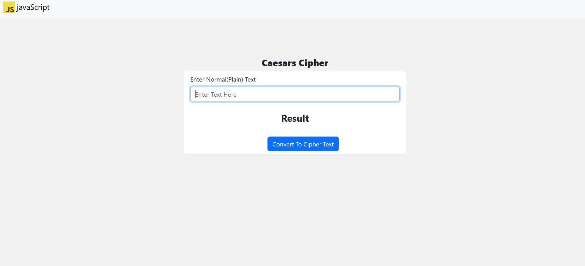
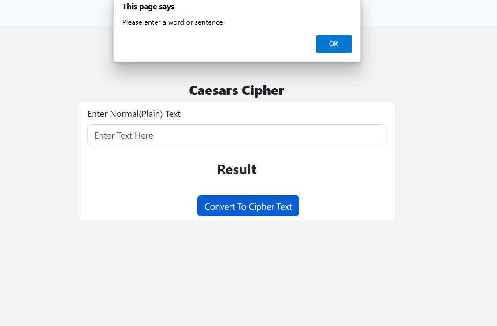
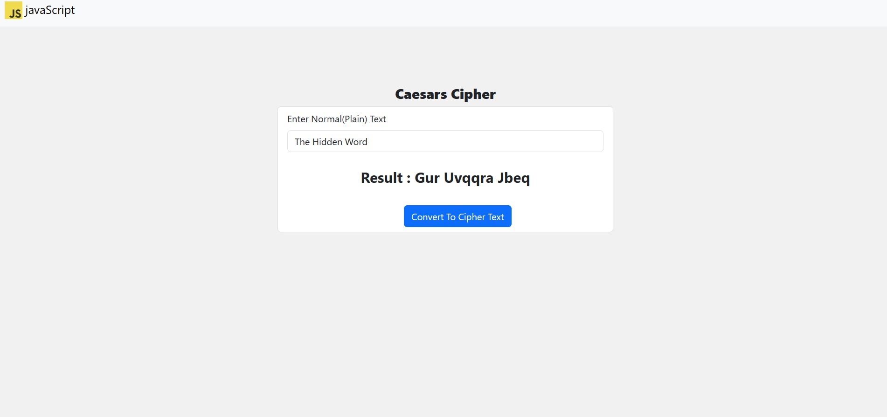

# Caesars Cipher project

This Caesar cipher project is a simple encryption method used in ancient times for sending secret messages. 

## Caesar Cipher

This is a simple implementation of the Caesar Cipher encryption algorithm. 

The Caesar Cipher is a substitution cipher where each letter in the plaintext is shifted a certain number of places down the alphabet. For example, with a shift of 3, "hello" becomes "khoor".

This code provides functions to encrypt and decrypt messages using the Caesar Cipher.

The Caesar Cipher works by shifting each character's ASCII value by a certain number of positions. In our case it rotates 13 times.

This project was built using HTML, CSS, Bootstrap and JavaScript Languages.

